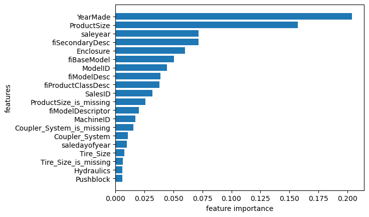

# Bulldozer Price Prediction  

## Overview  
This project is based on the Kaggle competition [Blue Book for Bulldozers](https://www.kaggle.com/c/bluebook-for-bulldozers).  
The goal of the competition is to **predict the sale price of bulldozers** at auction, given their usage history, equipment type, and configuration.  

This repository contains my end-to-end solution, including:  
- Data preprocessing and feature engineering  
- Model training and evaluation  
- Feature importance analysis  

---

## Dataset  
The dataset is **not included in this repository** due to its large size.  
It can be downloaded directly from Kaggle:  
👉 [Blue Book for Bulldozers dataset](https://www.kaggle.com/c/bluebook-for-bulldozers/data)  

---

## Dataset Setup  
To run this notebook locally, download the dataset from Kaggle:

1. Go to [Kaggle competition data](https://www.kaggle.com/c/bluebook-for-bulldozers/data).  
2. Download `TrainAndValid.csv`, `Valid.csv`, and `Test.csv`.  
3. Place them in a folder called `data/` in the root of this project.  

The notebook will automatically detect the dataset:  
- If running on **Kaggle**, it will use `/kaggle/input/...`.  
- If running **locally**, it will load from `data/`.  

---

## Approach  
1. **Data preprocessing**  
   - Parsing dates (`saledate`)  
   - Extracting useful features (e.g., `saleyear`)  
   - Handling categorical variables  
   - Dealing with missing values  

2. **Modeling**  
   - Trained a machine learning regression model (Random Forest)  
   - Tuned hyperparameters  
   - Evaluated performance using RMSLE  

3. **Feature importance**  
   - Identified the most influential features for price prediction  
   - Results help to interpret which machine characteristics impact prices most  

---

## Results  

Below is the **feature importance plot** from the final trained model:  



---

## How to Run  
1. Clone the repo  
   ```bash
   git clone https://github.com/your-username/bulldozer-price-regression.git
   cd bulldozer-price-regression
   jupyter notebook bulldozer_price_regression_1.ipynb
   ```
